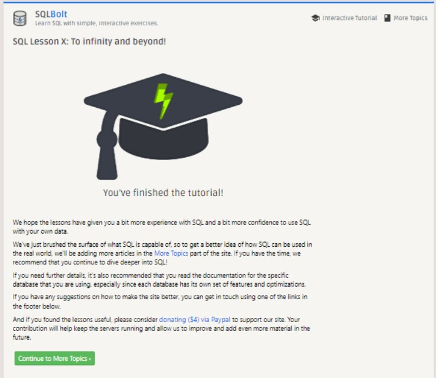

# Introduction to SQL

***

## Relational Database and SQL
After going through the lessons provided by SQLBolt, I now have a good understanding of relational databases and SQL. I have learned how to create, modify, and query databases, as well as use various SQL commands and functions to manipulate data. Additionally, I have gained knowledge on how to join tables, filter data, and perform aggregate functions. Overall, it has been a great learning experience.

